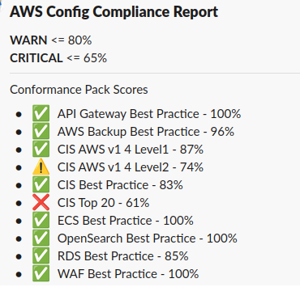

# config-conformance-pack-score-to-slack

Lambda function to send AWS Config Conformance Pack Scores to Slack Webook

## Variable settings
* `SLACK_WEBHOOK_URL` : Add your webhook URL for the the Slack app
* `WARN_THRESHOLD` : Percentage threshold for the warning icon to appear
* `CRITICAL_THRESHOLD` : Percentage threshold for the red X icon to appear

## Example Message

